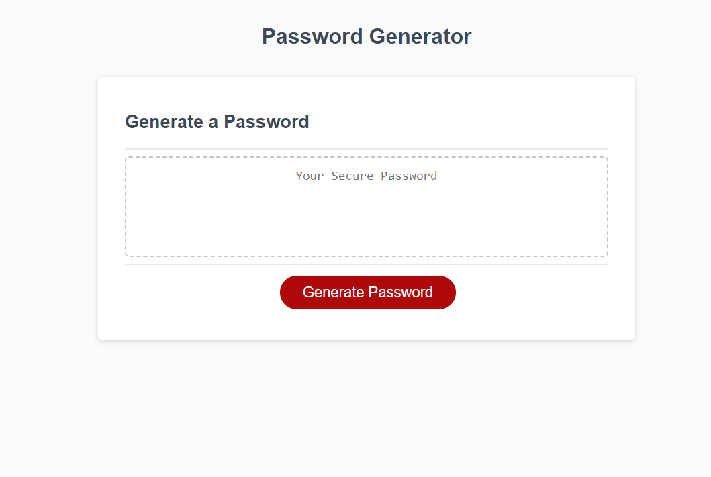

# Password Generator

## Description
This is a challenge I did for my bootcamp. I was tasked to complete the password generator using the starter code provided to me by the course. I utalised the knowledge I learnt over the last couple of weeks alongside some research and questions to friends and peers to help me achieve my final code. On occasions where I had exhausted every option I could think of, I used AI to point me in the right direction.

## Screenshot

## Live
Link: https://rajpreetkr.github.io/password-generator

## Credits
I used the following to help me get my answer and adjusted some of the code I found as needed:
https://discuss.codecademy.com/t/how-to-validate-a-range-of-number-input-in-javascript-and-end-the-loop-with-a-designated-input/616362
https://www.w3schools.com/jsref/jsref_isnan.asp
https://stackoverflow.com/questions/31737867/validate-user-input-from-prompt-in-javascript
ChatGPT

## Lisence
MIT License
